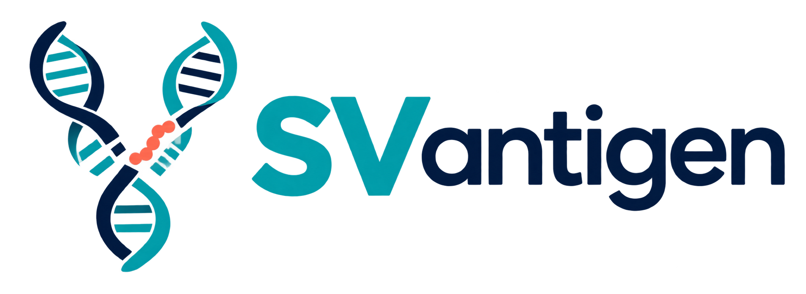
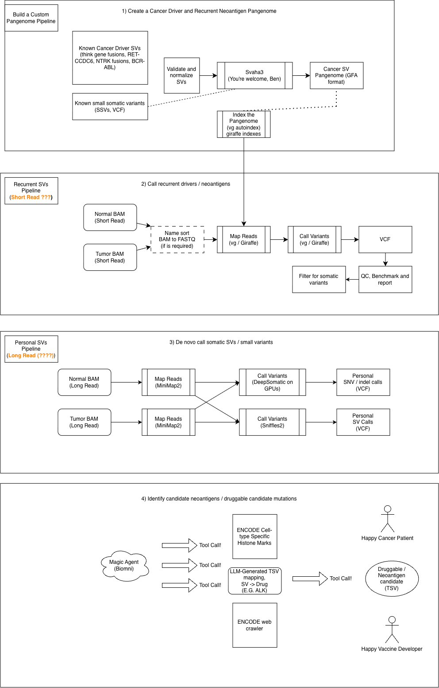
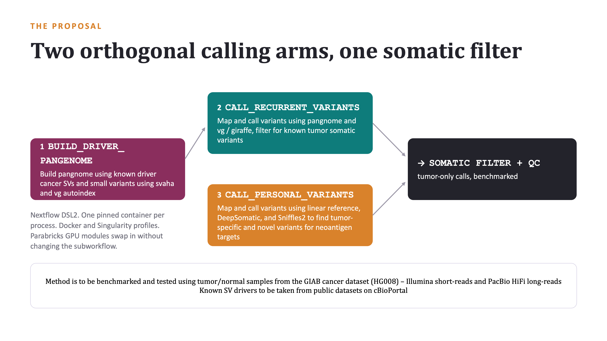
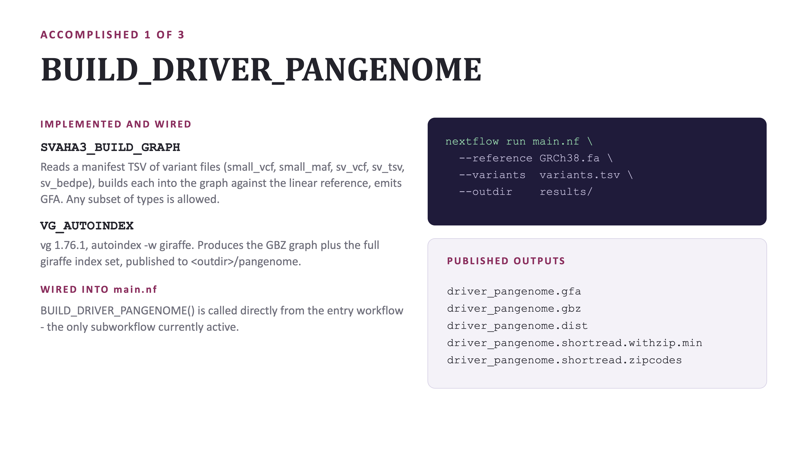
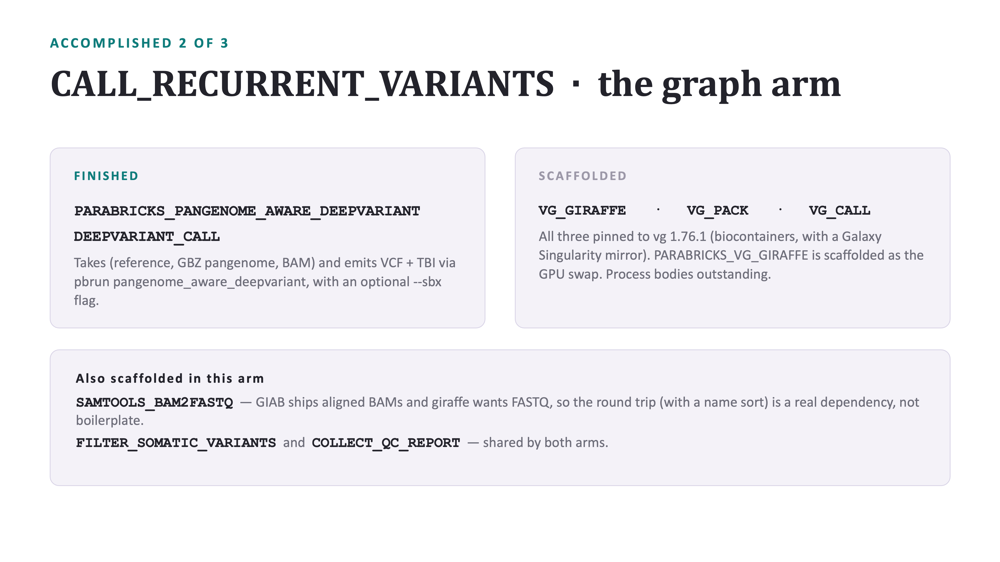
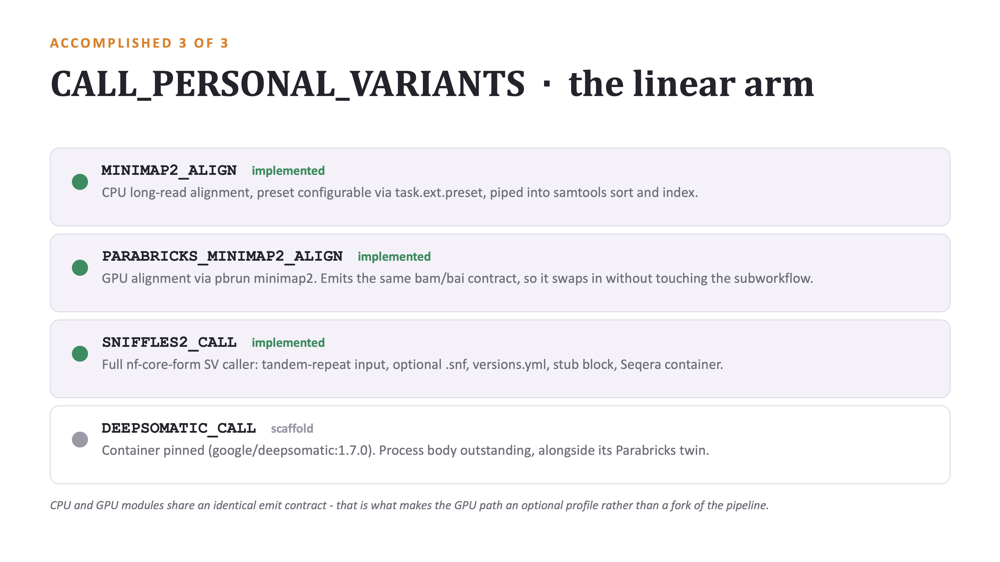
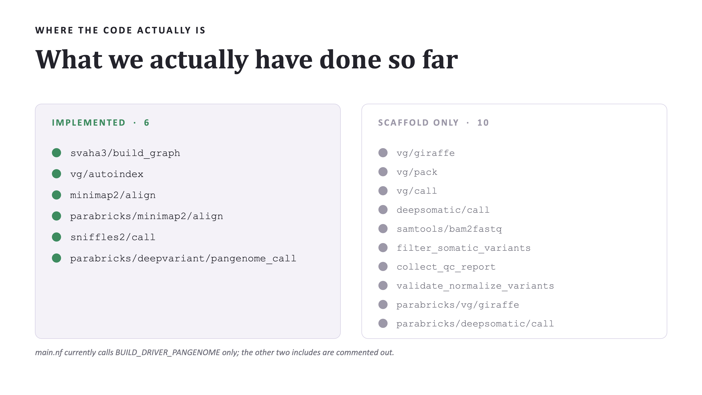
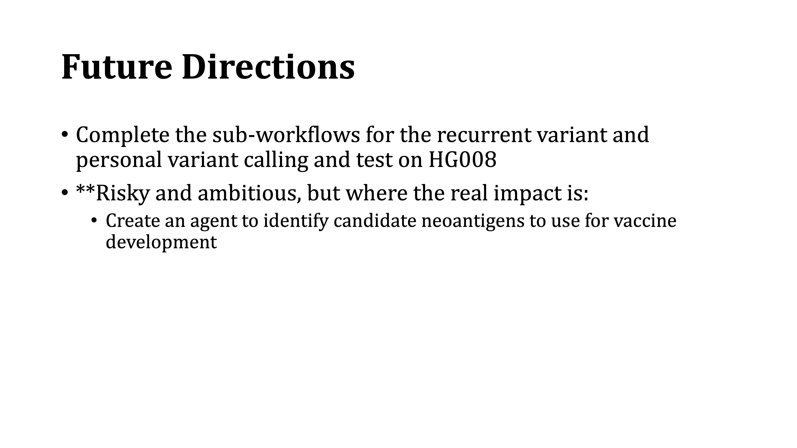
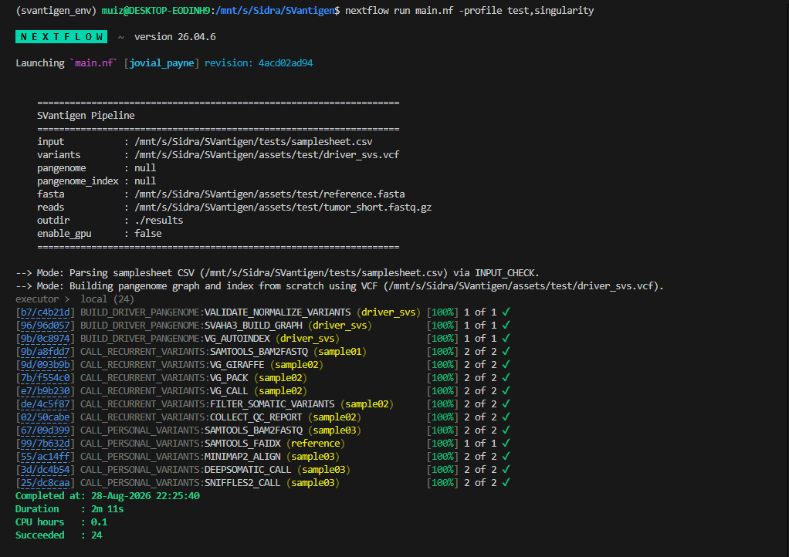
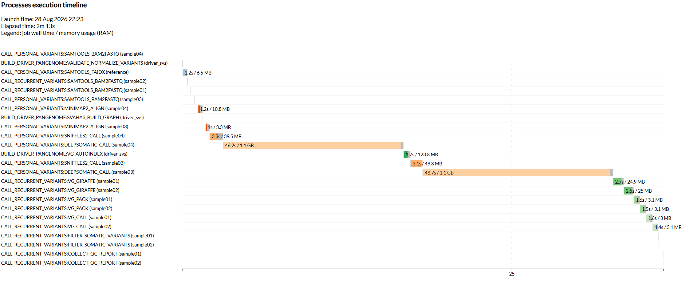

<div align="center">
  

  # SVantigen

  **Identifying candidate neoantigens and druggable mutations in structural variant space**

  [](https://www.nextflow.io/)
  [](https://sylabs.io/docs/)
  [](LICENSE)

</div>

---

On August 20, 2026, [Moderna and Merck published a blockbuster paper with initial results from a Phase II clinical trial demonstrating the efficacy of combined Keytruda + personal neoantigen therapy](https://www.nature.com/articles/d41586-026-02612-3). This approach used small variants unique to each patient's tumor — for over 1,000 patients — to create unique vaccines.

But small variants aren't the only variants that generate neoantigens. We know SVs exist in cancer cells and are often protein modifiers. If we can expand neoantigen candidate prediction to SV space, we will serve more cancer patients, especially since SV drivers and SSV drivers are often mutually exclusive in many cancer types.



---

## Goals

1. **Broaden neoantigen discovery beyond SNVs/indels** — build a Nextflow pipeline that detects somatic structural variants (SVs) and uses them as vaccine and drug targets alongside small mutations.

2. **Catch both personal and recurrent driver SVs** — run two complementary detection strategies in parallel: de novo personal variant calling against a linear reference (patient-unique mutations) and pangenome-based calling against a catalogue of known cancer-driver rearrangements (recurrent, potentially druggable).

3. **Remain accessible and reproducible** — all execution environments are containerised (Singularity / Docker); results reproduce on any Linux HPC or cloud cluster via a single `nextflow run` command.

4. **Enable GPU acceleration transparently** — NVIDIA Clara Parabricks modules for Minimap2 and DeepSomatic swap in automatically when `--enable_gpu` is set, without changing the workflow graph.

5. **Benchmark on real ground truth** — develop and validate against the GIAB HG008 pancreatic tumour/normal benchmark, which has published SV and small-variant truth sets, so sensitivity and precision can be measured objectively.

---

## Approach

### Pipeline Architecture

The pipeline is split into three executed subworkflows plus one planned future subworkflow:

```
samplesheet.csv  ──►  BUILD_DRIVER_PANGENOME  ──►  CALL_RECURRENT_VARIANTS  ──►  results/
  (long reads)   ──►  CALL_PERSONAL_VARIANTS  ──►  results/
```

| # | Subworkflow | Tools | Read type |
|---|---|---|---|
| 1 | `BUILD_DRIVER_PANGENOME` | `bcftools norm`, `svaha3`, `vg autoindex` | — (reference only) |
| 2 | `CALL_PERSONAL_VARIANTS` | `samtools`, `minimap2`, `DeepSomatic`, `Sniffles2` | Long reads |
| 3 | `CALL_RECURRENT_VARIANTS` | `vg giraffe`, `vg pack`, `vg call`, `bcftools` | Short reads |
| 4 | `PREDICT_NEOANTIGENS` *(future work)* | Agentic LLM tool-calling | — |

#### Subworkflow 1 — Build Driver Pangenome

A catalogue of known cancer-driver SVs (e.g. from COSMIC or a custom VCF) is normalised with `bcftools norm`, then compiled into a GFA pangenome graph with [`svaha3`](https://github.com/edawson/svaha) (`edawson/svaha:latest` Singularity image). The graph is indexed with `vg autoindex --workflow giraffe` to produce the `.gbz`, `.dist`, and `.min` index files used by downstream alignment.

> **Pangenome bypass**: if pre-built index files are already available they can be supplied directly via `--pangenome_index`, skipping this subworkflow entirely.

#### Subworkflow 2 — Call Personal Variants (long reads)

Long-read BAMs from the samplesheet are converted back to FASTQ (`samtools bam2fastq`), aligned to the linear reference with `minimap2`, and the alignments are passed to:
- **Sniffles2** — for somatic structural variant calling
- **DeepSomatic** — for somatic small variant (SNV/indel) calling

#### Subworkflow 3 — Call Recurrent Variants (short reads)

Short-read BAMs are aligned to the driver pangenome with `vg giraffe`. Coverage is packed with `vg pack` and genotyped with `vg call`. Calls are filtered to somatic-only and a per-sample QC report is collected.

### Key Design Decisions

- **`data_type` column in samplesheet** routes each sample automatically: `long` reads → Subworkflow 2, `short` reads → Subworkflow 3.
- **Reusable value channels** — reference FASTA, tandem-repeat BED, and graph index files use `.collect()` so they are shared across all samples without Nextflow queue-channel exhaustion.
- **`svaha3` Singularity image** — compiled from source with a fully statically linked binary (zlib embedded) to eliminate GLIBC version conflicts inside the container.
- **Modular GPU path** — Parabricks modules are isolated in `modules/local/parabricks/` and selected at runtime via `params.enable_gpu`, keeping the CPU and GPU paths independently testable.

### Future Work — Subworkflow 4: Neoantigen Prediction via Agentic LLM

> **Status: planned / future work**

The fourth step (`PREDICT_NEOANTIGENS`) would ingest the somatic VCF outputs from Subworkflows 2 and 3 and feed them to an **agentic AI engine** (cloud: Biomni / Magic Agent; local: Qwen 3.8–27B on EarthFrame hardware) with specialised tool calls:

- Query **ENCODE cell-type specific histone marks** (H3K4me3, H3K27ac) around SV breakpoints to assess chromatin accessibility.
- Generate **SV → drug mappings** (e.g. *ALK* fusions → Crizotinib, *RET* fusions → Selpercatinib) via LLM reasoning over structured databases.
- Output a prioritised `druggable_neoantigen_candidates.tsv` suitable for downstream vaccine design or clinical actionability review.

This subworkflow is architectured as both a Nextflow module and a standalone CLI (`python bin/predict_targets.py --vcf results/somatic.vcf`) so researchers can run it independently without re-running the alignment stages.

### Papers

- GIAB HG008 benchmark: https://www.nist.gov/programs-projects/cancer-genome-bottle
- HG008 dataset paper: https://www.nature.com/articles/s41597-025-05438-2
- SVantigen preprint: https://www.biorxiv.org/content/10.64898/2026.05.01.722316v2

### Datasets

For detailed direct download links to GIAB HG008 benchmark callsets (SV/CNV and small variants), selected ONT/Illumina read sets, and recurrent driver mutation databases, see:
- [Reference & Benchmark Datasets Guide](docs/datasets.md)

---

## Current Status

The following slides summarise what has been implemented as of the hackathon submission:








---

## Quickstart

The pipeline reads a CSV samplesheet of tumour/normal pairs and routes long reads to personal variant calling and short reads to recurrent driver calling.

### 1. Test Execution Out-of-the-Box

Dry-run with stub processes (no containers required):

```bash
nextflow run main.nf -profile test -stub-run
```

Full execution on the synthetic test dataset with Singularity containers:

```bash
nextflow run main.nf -profile test,singularity
```

By default, `-profile test` uses `tests/samplesheet.csv` for samples and `assets/test/driver_svs.vcf` for driver variants.

---

### 2. Operational Execution Modes

#### **Mode 1: Build Driver Pangenome from Scratch (Default)**

```bash
nextflow run main.nf \
    --input     samplesheet.csv \
    --variants  driver_svs.vcf \
    --fasta     GRCh38.fa \
    --outdir    results/ \
    -profile    singularity
```

#### **Mode 2: Use Pre-Built GFA Pangenome Graph**

Skip graph construction by supplying a pre-built `.gfa` file:

```bash
nextflow run main.nf \
    --input      samplesheet.csv \
    --pangenome  cancer_driver.gfa \
    --fasta      GRCh38.fa \
    --outdir     results/ \
    -profile     singularity
```

#### **Mode 3: Use Pre-Built Pangenome Index (Bypass Subworkflow 1)**

Completely bypass `BUILD_DRIVER_PANGENOME` by passing pre-indexed files:

```bash
nextflow run main.nf \
    --input            samplesheet.csv \
    --pangenome_index  "pangenome.gbz,pangenome.dist,pangenome.min" \
    --fasta            GRCh38.fa \
    --outdir           results/ \
    -profile           singularity
```

---

### 3. Samplesheet Format (`samplesheet.csv`)

```csv
pair_id,sample,status,data_type,bam
pair_01,sample01,tumor,short,path/to/sample01.short.bam
pair_01,sample02,normal,short,path/to/sample02.short.bam
pair_02,sample03,tumor,long,path/to/sample03.long.bam
pair_02,sample04,normal,long,path/to/sample04.long.bam
```

| Column | Values | Description |
|---|---|---|
| `pair_id` | string | Tumour/normal pair identifier |
| `sample` | string | Unique sample name |
| `status` | `tumor` / `normal` | Sample type |
| `data_type` | `short` / `long` | Sequencing read type — routes to correct subworkflow |
| `bam` | path | BAM or FASTQ file path |

---

### 4. Output Results

Everything is published under `results/`:

| Directory | Description |
|---|---|
| `results/pangenome/graph/` | Pangenome variation graph (`.gfa`) |
| `results/pangenome/index/` | Giraffe index files (`.gbz`, `.dist`, `.min`) |
| `results/pangenome/normalized_vcf/` | Normalised driver SV VCF |
| `results/recurrent_variants/vg_call/` | Graph-genotyped somatic VCFs (per sample) |
| `results/recurrent_variants/filtered/` | Somatic-filtered VCFs |
| `results/recurrent_variants/qc/` | Per-sample QC HTML reports |
| `results/personal_variants/sniffles2/` | Sniffles2 SV calls (`.vcf.gz`, `.snf`) |
| `results/personal_variants/deepsomatic/` | DeepSomatic small-variant VCFs |

---

### 5. GPU Acceleration & Parabricks

All GPU-accelerated modules (NVIDIA Clara Parabricks) are isolated under `modules/local/parabricks/`:

- `modules/local/parabricks/minimap2/align.nf`
- `modules/local/parabricks/deepsomatic/call.nf`
- `modules/local/parabricks/vg/giraffe.nf`

Pass `--enable_gpu` to activate them; subworkflows route automatically.

---

## Local Test Run Results

The pipeline was validated locally using the synthetic test dataset (`-profile test,singularity`). All **24/24 tasks completed successfully** in under 2 minutes on a local workstation.

### Terminal Output



### Execution Timeline



The timeline shows the three subworkflows executing in the correct dependency order:
- `BUILD_DRIVER_PANGENOME` runs first (graph construction → indexing)
- `CALL_PERSONAL_VARIANTS` and `CALL_RECURRENT_VARIANTS` run in parallel once their respective prerequisites are met

---

## Repository Structure

```
SVantigen/
├── main.nf                          # Main Nextflow entry point
├── nextflow.config                  # Pipeline configuration
├── assets/test/                     # Synthetic test data (reference, VCF, BAMs)
├── conf/                            # Profile configs (test, singularity, gpu)
├── containers/
│   └── svaha.def                    # Singularity definition for svaha3
├── docs/                            # Extended documentation
│   ├── datasets.md                  # GIAB HG008 dataset download guide
│   └── usage.md                     # Full parameter reference
├── images/                          # Figures and screenshots
├── modules/local/                   # Nextflow process modules
│   ├── bcftools/
│   ├── deepsomatic/
│   ├── minimap2/
│   ├── samtools/
│   ├── sniffles2/
│   ├── svaha3/
│   ├── vg/
│   └── parabricks/                  # GPU-accelerated variants
├── subworkflows/local/
│   ├── build_driver_pangenome.nf
│   ├── call_personal_variants.nf
│   └── call_recurrent_variants.nf
└── tests/
    └── samplesheet.csv              # Test samplesheet
```

---

## License

[MIT](LICENSE)

## Contributors

| Name | GitHub |
|---|---|
| Martín E. García Solá | [@martings](https://github.com/martings) |
| Eric T. Dawson | [@edawson](https://github.com/edawson) |
| Ben Busby | [@DCGenomics](https://github.com/DCGenomics) |
| Muiz Mohamed | [@muaiz](https://github.com/muaiz) |
| Ayman Hussein | [@AymanHussein15](https://github.com/AymanHussein15) |
| Joshua Law | [@JoshuaLZJ](https://github.com/JoshuaLZJ) |
| Julian Chiu | [@jchchiu](https://github.com/jchchiu) |
| Nikhil Damle | [@nikhildamle01](https://github.com/nikhildamle01) |
| Ryan Perez | [@PerezTheDev](https://github.com/PerezTheDev) |

## Contributing

Contributions, issues and feature requests are welcome. Please open an issue to discuss before opening a pull request.

See [docs/usage.md](docs/usage.md) for the full parameter reference and [docs/output.md](docs/output.md) for a detailed description of every output file.
