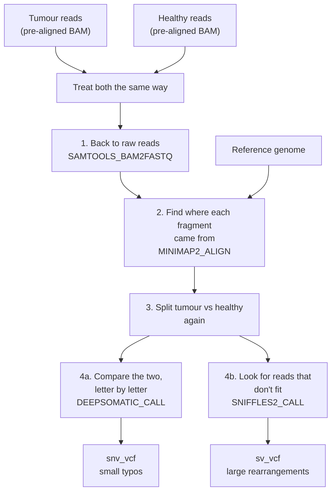

# Personal variants, explained

A plain-language companion to
[`subworkflows/local/call_personal_variants.nf`](../subworkflows/local/call_personal_variants.nf).
It covers what the project is trying to do biologically, and why this
subworkflow is built the way it is.

## The problem we're trying to solve

A tumour is a group of the patient's own cells whose DNA has been damaged. That
damage makes them build proteins that no healthy cell in the body builds. Those
odd proteins are the one thing that visibly separates a tumour cell from a
healthy one, which makes them a target: if you can show the immune system what
they look like, it can hunt down the cells making them. That is what a
personalised cancer vaccine is — a list of "wanted posters" made from one
specific patient's tumour.

To make those posters you first have to find the damage. Today that search
almost always looks for **single-letter typos** in the DNA: one chemical letter
swapped for another. But DNA also gets damaged in much bigger ways — whole
paragraphs deleted, copied twice, flipped backwards, or torn out and pasted
somewhere else entirely. When a paragraph is pasted into the middle of a
different gene, the cell reads straight through the seam and builds a protein
that is half one gene and half another. Nothing like it exists anywhere in a
healthy body, which makes it an unusually clean target.

Those large rearrangements are what SVantigen goes looking for, and they are
routinely skipped today. Some cancers are driven almost entirely by big
rearrangements rather than typos, so those patients currently get left out of
this kind of treatment altogether.

## Why we need two samples from the same patient

Every person's DNA already differs from the "textbook" reference genome in
millions of places. Those differences are inherited — they were in the very
first cell that person ever had, so they are in every cell of their body,
tumour and healthy alike. They are not cancer, and using one as a vaccine
target would aim the immune system at the patient's own healthy tissue.

So we sequence two things: the tumour, and a healthy sample from the same
person (called the "normal"). Anything present in both is inherited and gets
thrown away. Anything present only in the tumour is damage the cancer acquired,
and that is what we keep. The normal sample is the control that makes the
comparison meaningful.

## What the subworkflow does, step by step

### 1. Back to raw reads

Sequencing machines read DNA in short fragments, like shredding a book and
reading the strips. The files we are handed have already had someone else's
software guess where each strip belongs. We undo that, because tumour and
normal must be laid out by the *same* method against the *same* reference
before we can compare them — otherwise a difference between the two might just
be a difference in how they were processed.

### 2. Find where each fragment came from

Now we place the strips ourselves, against a single reference genome. This is
the slow, expensive step, and it is why the pipeline has an optional
graphics-card version of it. Both samples go through identical treatment, which
is why the code merges them into one stream here rather than handling each
separately.

### 3. Split tumour and healthy apart again

Having been treated identically, they now need to be told apart, because the
two searches that follow need them in different combinations. The code does
this using a label that has been riding along with each sample the whole time.

### 4a. Compare the two, letter by letter

This is the search for small typos. At each position we ask: do the tumour
fragments read differently from the healthy ones? Both samples are needed
together, side by side, which is why the code carefully re-pairs each tumour
with its own matched healthy sample and not somebody else's.

### 4b. Look for fragments that don't fit

This is the search for large rearrangements, and it works on completely
different evidence. Here we ignore the letters and watch for strips that
*cannot* be laid down cleanly: one whose front half belongs to chromosome 4 and
whose back half belongs to chromosome 12, or pairs of strips that land much
further apart than they physically could. A pile of fragments failing in the
same way at the same spot is the signature of a chunk of DNA having been moved.

This is also why the project needs two separate tools rather than one. A typo
and a rearranged chromosome leave nothing in common as evidence, so no single
program finds both well.

## Why the two answers stay separate

Small typos and large rearrangements come out of different tools, are stored in
different ways, and get handled differently afterwards — turning a
rearrangement into a candidate vaccine target means working out what protein
the new seam produces, which is a very different question from what a single
swapped letter does. Merging them into one pile would only mean pulling them
apart again later, so the subworkflow hands back two labelled results.

## What this subworkflow does *not* do yet

- It doesn't run. Two of the four tools are still empty placeholders; the
  wiring between them is what was built here.
- It doesn't do the tumour-versus-healthy subtraction for large
  rearrangements. Right now the rearrangement search looks at the tumour only.
  Filtering those down to tumour-specific ones is deliberately left to a later
  step.
- It doesn't decide which findings would make good vaccine targets. That comes
  after, once both result files exist.
